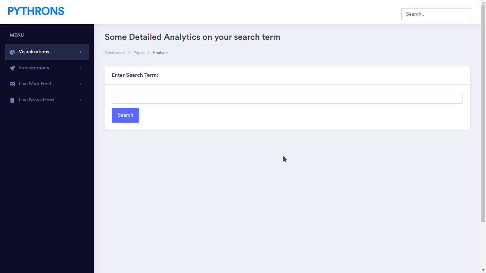
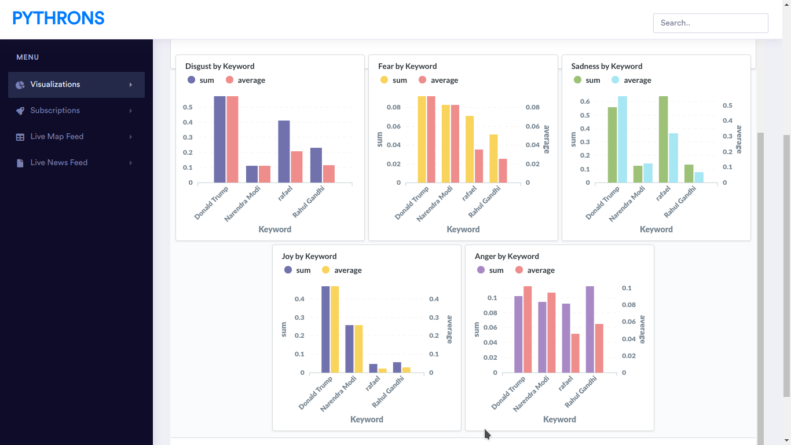
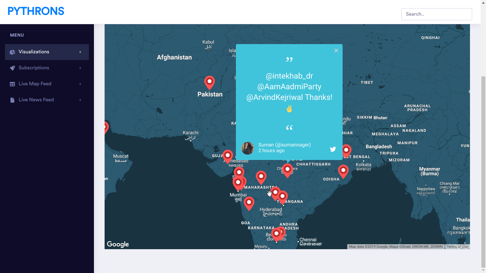
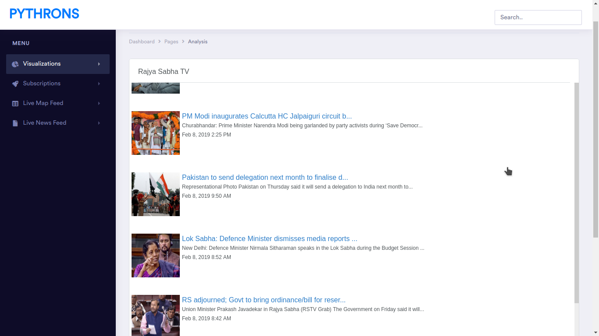

# Sentiment Analysis over Political data - RAJSHASTRA
**Concept** Political analysis using social media is used to understand the public opinion and trend especially during election time. With the ever emerging social media, more and more people are expressing their sentiments about current affairs on blogs, microblogs and social networking sites.
### Screenshot

  
  
  
  

### Developers
- [Milind Shah](https://github.com/mlndshh)
- [Keval Nagda](https://github.com/pumpkinman008)
- [Pratik Mulchandani](https://github.com/prtk1910)
